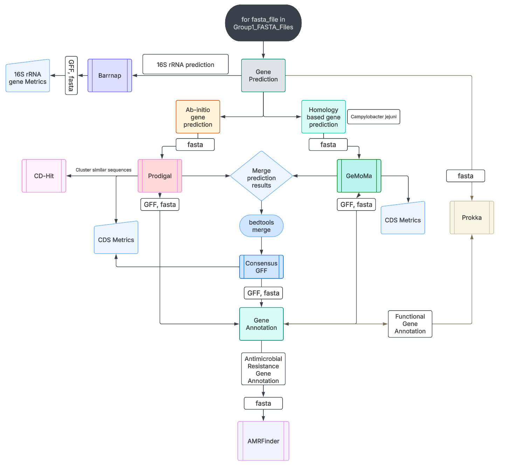

# Gene Prediction and Annotation Pipeline

This is a Bash pipeline I wrote for predicting and annotating genes in bacterial genomes. It was originally developed as part of a group project, however I took up the responsibility of writing the script after our workflow was finalised. The idea was to take genome assemblies and generate functional gene annotations using a combination of reference-free and homology-based tools.



## System Requirements

This pipeline is built for **macOS (ARM64)** and was tested on Apple Silicon. With minor tweaks, it should also work on Linux.

- **Bash** ≥ 5.2.21
- **Conda** ≥ 25.1.1
- **Homebrew** (for certain package installs)

### Required Packages / Tools

- `Prokka` – annotation
- `Prodigal` – gene prediction
- `GeMoMa` – homology-based prediction
- `Barrnap` – rRNA prediction
- `AMRFinderPlus` – AMR gene detection
- `Bedtools` – sequence extraction
- `BLAST+` ≥ 2.2.31
- `Java` 11
- `Perl`, `curl`, `awk`, `gzip` (for processing, mostly pre-installed)

All dependencies can be installed via `conda` and `brew`.

---

## Usage

Run the script like this:

```bash
bash GenePredAnn_Mac.sh <path_to_input_fasta_folder>/ <path_to_output_folder>/
